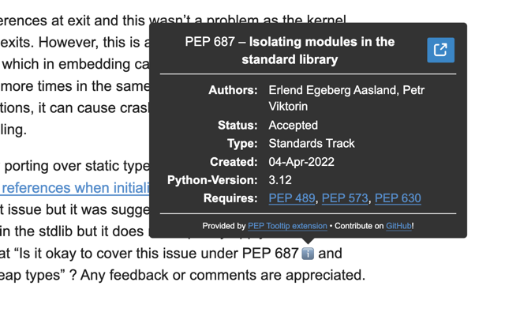
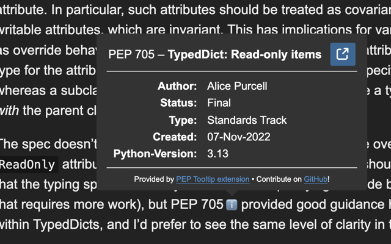

# PEP Tooltip

_PEP Tooltip_ is a Chrome extension to add tooltips containing key information about _Python Enhancement Proposals_ (PEP) mentioned in [discuss.python.org](https://discuss.python.org) messages.

 | 
---------------------------------------------------|--------------------------------------------------

## Features

This extension scans messages contents to add a ℹ️ emoji next to each occurrence of of the `PEP XXX` (case-insensitive) pattern. On hover, a tooltip appears displaying key information about the PEP (retrieved from [peps.python.org](https://peps.python.org) official API).

To keep the popup digest, only a subset of PEP information fields are displayed; these may change based of feedback!

Messages loaded when scrolling one the page are detected and processed too (but not just posted / edited messages, at the moment).

### Options

No customization options are provided at the moment.

## Install

Get the extension from the Chrome Web Store: [PEP Tooltip – Chrome Web Store](https://chrome.google.com/webstore/detail/fkheggfpgnfefhdannmjnkjehjnceokl). Packaged versions are also available as GitHub releases.

Only Chromium-based browsers are supported at the moment.

### Permissions

This extension only requires the permission to read and update content on `https://discuss.python.org/*`. It does not collect any form of data.

## Development instructions

This extension is written in TypeScript. It's only dependency is [Tippy.js](https://atomiks.github.io/tippyjs), which is bundled as part of the extension.

If using VS Code, you may want to install [lit-html](https://marketplace.visualstudio.com/items?itemName=bierner.lit-html) extension to benefit from syntax highlighting of `` html`...` `` template strings (even if PEP Tooltip do not use `lit-html` lib, but a custom minimalist implementation).

### Clone this repository

```bash
git clone https://github.com/loic-simon/pep-tooltip.git
cd pep-tooltip
```

### Build the extension

```bash
cd chrome
npm install
npm run build
```

You may need to [install `node`](https://nodejs.org/en/download/package-manager).

### Install local extension (Google Chrome)

- Visit [chrome://extensions](chrome://extensions) on Google Chrome
- Enable developer mode using the toggle in top right side
- Click "Load unpacked" button on top left
- Select the `chrome/dist` folder of the repo and validate
- It should work!

## Contributions

All contributions are welcome! Feel free to open an issue and/or PR for any bug or request.
